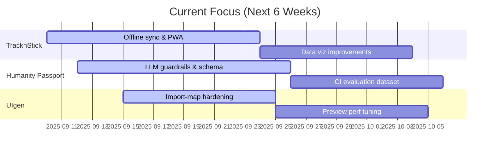

# 👋 Hi, I'm Jayvic San Antonio

💻 Full‑Stack Web Developer | ⚡ AI Explorer | 🌍 Lifelong Learner

I build thoughtful web systems that pair clean engineering with creative UX. I’ve shipped end‑to‑end products across React/Next.js, Node.js, and serverless APIs—lately going deep on AI agents and developer‑focused automations. After a layoff, I took a sabbatical to travel, reflect, and sharpen my skills. I came back building more intentionally: typed APIs, robust testing, CI/CD, and small touches that make products feel alive.

When I’m not coding, I’m usually chasing cats off my keyboard, walking for Pokémon Go, or tinkering with coffee‑fueled late‑night experiments.

---

## 🛠️ Tech Stack & Tools

Core web
 

APIs & data
 

Quality & DevEx
 

AI & agents
 

Mobile & graphics
 

---

## ✨ What I’m Known For

- End‑to‑end product work: typed serverless APIs (Cloudflare Workers + Hono) paired with modern React/Next.js frontends.
- Engineering hygiene: strict TypeScript, Zod validation at the edges, Vitest/Jest, Testing Library, and CI that actually helps.
- Practical AI: LLM integrations with structured outputs, validation, and guardrails—less “demo”, more “maintainable”.
- Developer‑first automation: scheduled GitHub Actions, PR bots, coverage gates, and release workflows.

---

## 🚀 Featured Projects

<table>
  <tr>
    <td>
      
    </td>
    <td>
      
    </td>
  </tr>
  <tr>
    <td>
      
    </td>
    <td>
      
    </td>
  </tr>
  <tr>
    <td>
      
    </td>
    <td>
      
    </td>
  </tr>
  <tr>
    <td>
      
    </td>
    <td>
      
    </td>
  </tr>
  <tr>
    <td>
      
    </td>
    <td>
      
    </td>
  </tr>
</table>

- TracknStick (web + API): Modern habit tracking with a React/Vite app and a Cloudflare Workers API (Hono, Zod, Vitest, Miniflare, CI deploys).
- Humanity Passport: Next.js + Prisma project that analyzes GitHub repos with LLMs and validated structured outputs.
- AI Timeline Automation: A scheduled GitHub Actions system that collects, dedupes, and PRs weekly AI news.
- Portfolio (jayvicsanantonio.dev): Next.js site with Lighthouse CI, perf budgets, and typed content.
- Web Development Hub: Next.js on Cloudflare via OpenNext; forms, UI primitives, and deployment scripts.
- AI Hallucination Detector: A monorepo with content processing pipelines aimed at enterprise‑grade detection.
- Task Relay: Lightweight Node/Hono API with CI and coverage for task syncing.
- Sync Flow: Typed Hono service using Upstash/Redis and Zod validators for reliable flow orchestration.

---

## 🌱 Currently Exploring

- AI tools & agents for productivity, repo analysis, and code generation (with strict validation and safety).
- Serverless patterns on Cloudflare Workers (edge auth, schema‑driven APIs, caching strategies).
- Playful experiments with WebGL/Babylon.js and small polished UX flourishes.

---

## 🔬 Currently Hacking On

- TracknStick: Offline‑friendly sync, progressive web app polish, and richer data viz.
- Humanity Passport: Safer LLM analysis with stricter schema validation and better failure handling.
- UIgen: Faster JSX/TS transforms and sandboxed preview reliability for complex imports.

---

## 📊 GitHub Stats

---

## ⚡ Lighthouse & Performance (jayvicsanantonio.dev)

• Run live analysis: https://pagespeed.web.dev/analysis?url=https%3A%2F%2Fjayvicsanantonio.dev

---

## 🏆 Achievements

---

## 📈 Activity Graph

---

## ✨ Fun Facts

- 🐾 Certified cat‑herder (they schedule pair programming without asking).
- 🎮 Pokémon Go walker—yes, commits sometimes correlate with PokéStops.
- ☕ Most ideas ship between 10pm–2am, powered by espresso.

---

## 🔗 Links

- Portfolio: https://jayvicsanantonio.dev  
- Email: codes@jayvicsanantonio.dev

---

---

### Optional extras to make this pop even more

- Add “Latest Posts” from your blog with a simple GitHub Action that updates a section from an RSS feed.
- Pin 2–3 more repos using the pin cards above (e.g., `cogni-critter`, `extensions`) for breadth.
- Add a “Currently hacking on” section with short‑term goals or a roadmap image.
- Include Lighthouse/Performance badges for `jayvicsanantonio.dev` (you already run Lighthouse CI).
- Embed a short GIF demo for one project (TracknStick or UIgen) to show UX polish.
